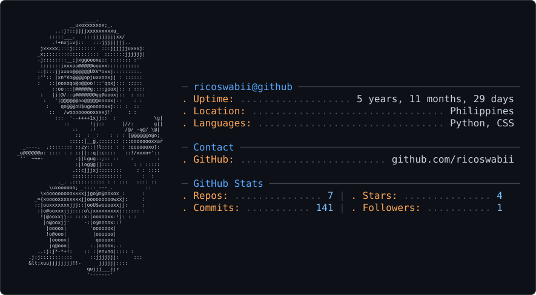

<picture>
  <source media="(prefers-color-scheme: dark)" srcset="dark_mode.svg">
  <source media="(prefers-color-scheme: light)" srcset="light_mode.svg">
  
</picture>

 

  <strong>Cybersecurity & Tech Enthusiast</strong> 
  Defensive Security · Networking · IT Support · Automation

  

 

---

## 👋 About Me

I'm **Rico**, a cybersecurity and technology enthusiast who enjoys learning how systems work, breaking things in controlled environments, and building practical solutions.

Currently focused on:

* 🛡️ **Cybersecurity Defense & Blue Teaming**
* 🌐 **Networking & Infrastructure**
* 🖥️ **Linux & System Administration**
* 🔎 **Security Monitoring & SIEM**
* 🧰 **IT Support & Troubleshooting**
* ⚙️ **Automation & Scripting**

 

---

## ⚙️ Technical Stack

### `SYSTEMS`

  

### `SECURITY & NETWORKING`

  

  Wireshark · Cisco · Snort · Splunk · Elasticsearch · Active Directory

### `DEVELOPMENT`

  

### `TOOLS & DESIGN`

  

  Canva · Adobe Photoshop · Hootsuite · VirtualBox

---

## 🔭 Currently Working On

### 🦈 CyberShark

**IT Troubleshooting & Support Application**

A practical project focused on helping users diagnose common IT problems and find troubleshooting solutions.

---

## 🌱 Currently Learning

`Cybersecurity Defense` · `Advanced Networking` · `Ethical Hacking`

`SOC Operations` · `SIEM` · `Linux Administration`

---

## 🧪 Research & Projects

I enjoy building projects and documenting what I learn through hands-on experimentation.

Some areas I'm exploring:

* 🔐 Cybersecurity research
* 🛡️ Blue Team / SOC workflows
* 📡 Network monitoring
* 🐧 Linux administration
* 🔎 Digital forensics
* ⚙️ Security automation
* 🧰 IT troubleshooting
* 🧠 Technical experimentation

> **Learn → Build → Break → Investigate → Document**

---

## 📡 GitHub Status

  
  

  

---

## 🌐 Connect

&nbsp;&nbsp;

&nbsp;&nbsp;

&nbsp;&nbsp;

&nbsp;&nbsp;

&nbsp;&nbsp;

&nbsp;&nbsp;

 

  <a href="https://ricoswabii.github.io/">
    <strong>↗ Visit my portfolio</strong>
  </a>

 

  Built with curiosity, caffeine, and too many terminal windows.

